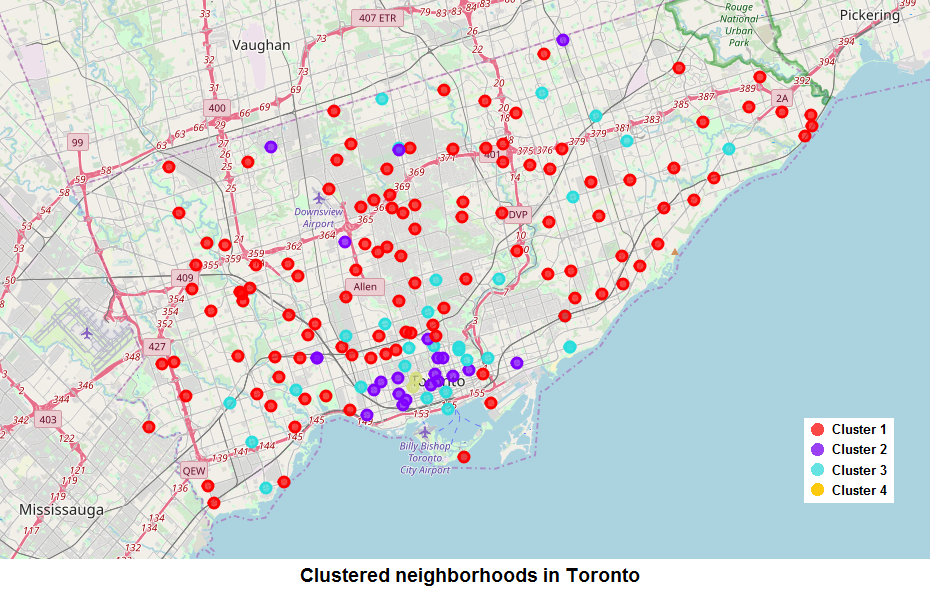

# Segmenting and Clustering Neighborhoods in Toronto  
## Introduction  
In this project I will explore and analyze the differences between neighborhoods of Toronto to try and answer the following question: "What is the best place in Toronto to open a new Chinese food restaurant?". This project will serve as a useful tool for the group of stakeholders and will help them make a knowledgeable choice of the place suitable for starting the new food venue specializing in Chinese cuisine. The described problem would be solved using Foursquare location data in addition to other datasets, such as Canada Census of Population.  
## Data  
The project will use the list of venues near each of Toronto neighborhood location provided by Foursquare using Foursquare Places API. Additionally, the project will use data on demographics of Toronto neighborhoods, including average income, second most common language (after English) and its proportion. The described data will be obtained from Canada Census of Population (https://www12.statcan.gc.ca/census-recensement/index-eng.cfm). The Foursquare data will provide the understanding of already existing venues, and the general popularity of food venues in a given area. The demographics data will indicate local people's taste, since neighborhood with a majority of Chinese speaking population would be a good place for the Chinese restaurant.
## Methodology  
In the first step of this project the demographic data on each Toronto neighborhood would be taken from the Canadian census.  After that, the latitude and longitude of each neighborhood will be retrieved using Python library geopy. The Nominatim geolocation service will be used to get the data from OpenStreetMap project. Using the foursquare Places API, we will retrieve nearby food venues for each of the neighborhood locations. All this data would be combined into one Pandas dataframe. The final dataframe will consist of the neighborhood name, Chinese language as a second language proportion, the number of Chinese food venues, and the total number of food venues in 500 meters vicinity.  
All the data would be normalized and rescaled independently of other features so that its norm would equal 1. After that, the K-Means clustering algorithm will be applied to partition our neighborhoods into k clusters. The K-Means clustering algorithm is chosen because the aim of machine learning in current project is to predict a category on the labeled data with reasonable amount of samples.  
## Results  
As a result, different neighborhoods of Toronto were clustered into 4 different clusters, as seen on following image.  
  
Cluster 1 is characterized by having low total amount of food venues. Cluster 2 is characterized by having high total amount of food venues and low population income. Cluster 3 is characterized by having high total amount of food venues and medium to high population income. Cluster 4 is characterized by having high total amount of food venues and high number of people speaking Chinese as a second language after English.
## Discussion  
The analysis of results shows that neighborhoods in Cluster 4 are best suitable for starting the new food venue specializing in Chinese cuisine. The best places would be Kensington Market or Alexandra Park area.
## Conclusion
In conclusion, I successfully explored and analyzed the differences between neighborhoods of Toronto in this project. The problem was solved by using Foursquare Places API data, Canada Census of Population data and applying the K-Means clustering algorithm to normalized features of our dataset. As the result of the project, I can recommend the Kensington Market or Alexandra Park area as the best places to start the new food venue specializing in Chinese cuisine. The methodology could be further used by decision-makers to make a choice of the place suitable for other types of business.